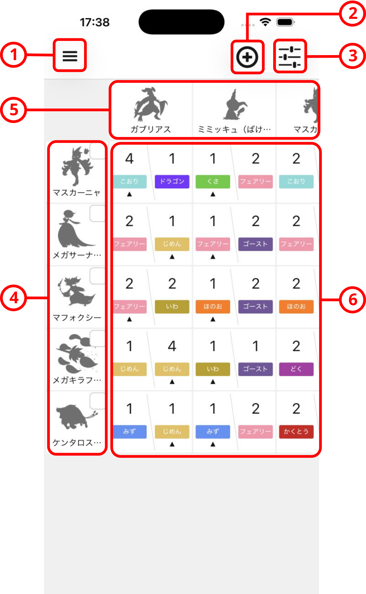
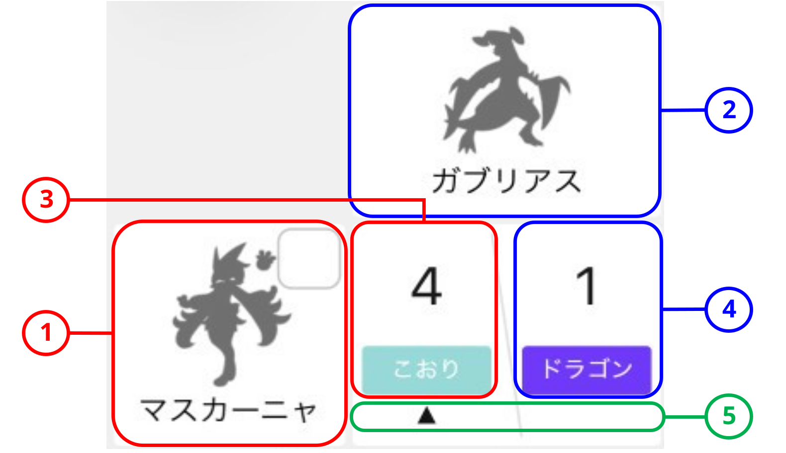
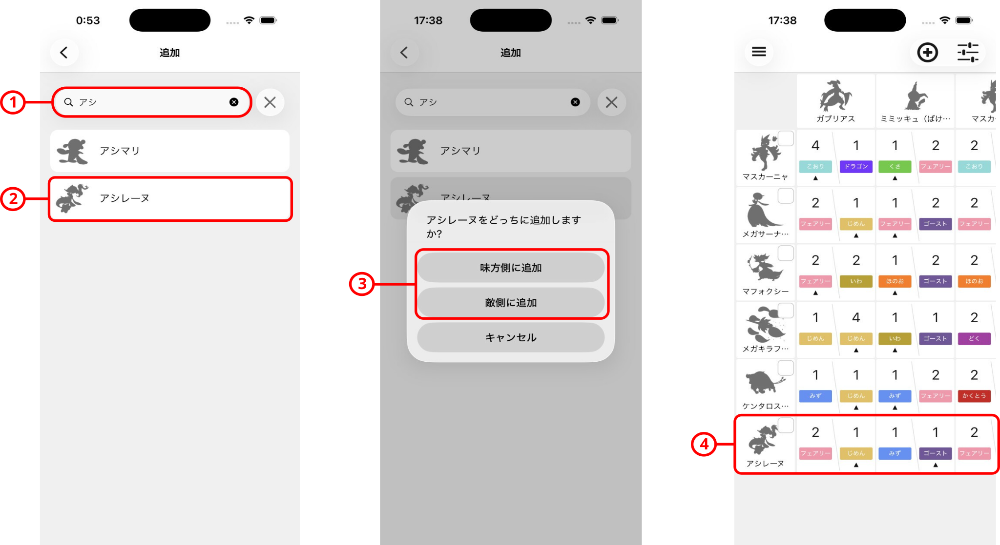
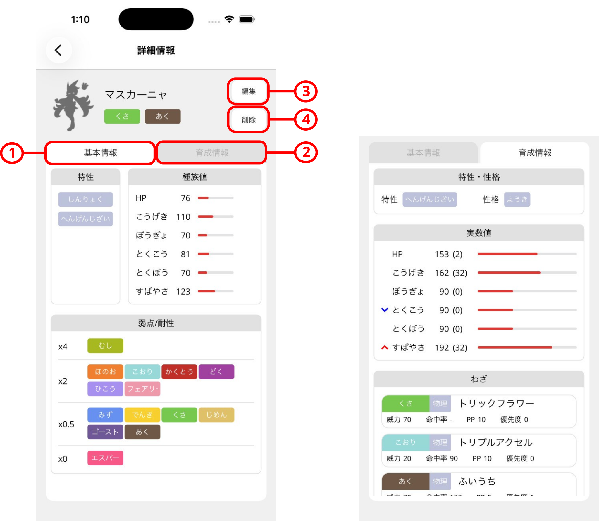
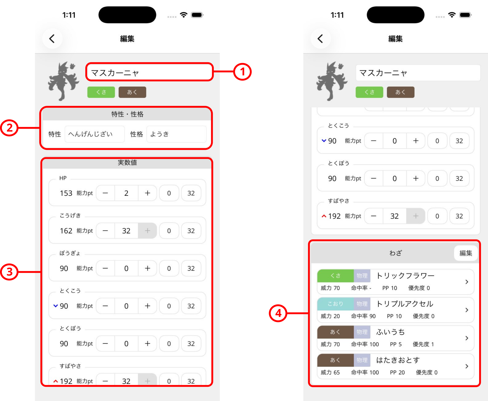
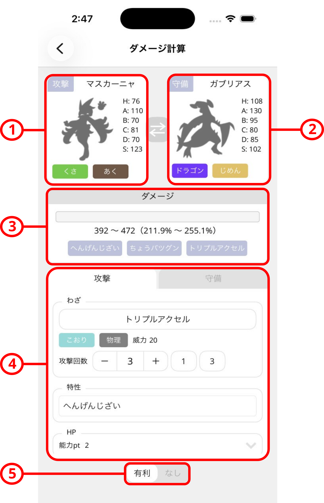
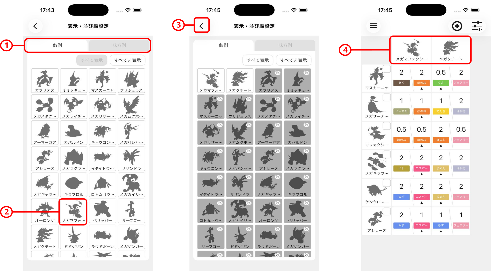
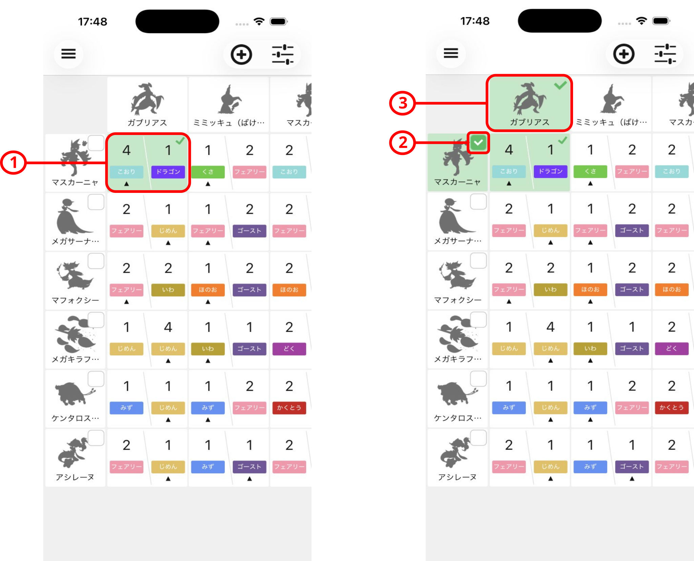

---
layout: default
title: 使い方
lang: ja
---

# 使い方

## 1. アプリの概要

ポケ相性チェッカーは、ポケモン同士のタイプ相性を表形式で分かりやすくまとめて確認できるアプリです。 
対戦するポケモンの組み合わせごとに、覚えているわざのなかで最もタイプ相性のよいわざのタイプと倍率を表示できます。 
味方から敵への攻撃だけでなく、敵から味方への攻撃のタイプ相性も分かるため、タイプ相性を覚えてなくても、初心者でも一目で有利に戦えるかどうかを判断できます。 
パーティ構築時、環境でよく使われるポケモンに対抗できるポケモンがパーティにいるかを確認したり、対戦時に選出するポケモンを決めたりする際に活用できます。

**注意事項**
- 「もちもの」には現在未対応です。
- ダメージ計算において一部の特性・わざの効果には未対応です。
- 対応している特性・わざであれば大半は正しくダメージ計算されますが、それを保証するものではありません。
  正確な計算は他のサイト等をご利用ください。

## 2. メイン画面の各部

| 番号 | 項目 | 説明 |
|---|---|---|
| 1 | メニュー | メニューを開きます。 |
| 2 | [追加](#add-pokemon) | 味方または敵のポケモンを追加します。 |
| 3 | [表示・並び順](#display-order) | 相性表に表示するポケモンの表示・非表示や並べ替えを行います。 |
| 4 | 味方ポケモン（行） | 味方ポケモンの一覧を行方向に表示します。ポケモンをタップすると、[ポケモン詳細情報](#pokemon-info)を開きます。 |
| 5 | 敵ポケモン（列） | 敵ポケモンの一覧を列方向に表示します。ポケモンをタップすると、[ポケモン詳細情報](#pokemon-info)を開きます。 |
| 6 | 相性結果 | ポケモンの相性結果を表示します。セルの見方は[対戦相性表の見方](#how-to-read-matrix)を確認してください。セルをタップすると、その組み合わせの[ダメージ計算画面](#damage-calculation)を開きます。 |

表は上下左右にスクロールできます。ポケモンが多い場合は、確認したい行や列までスワイプしてください。

## 3. 対戦相性表の見方 {#how-to-read-matrix}

| 番号 | 項目 | 説明 |
|---|---|---|
| 1 | 味方ポケモン | 味方のポケモンです。 |
| 2 | 敵ポケモン | 敵のポケモンです。 |
| 3 | 味方から敵への攻撃 | 味方が覚えているわざのうち、敵に対して最もタイプ相性が良いわざのタイプと倍率を表示します。 |
| 4 | 敵から味方への攻撃 | 敵が覚えているわざのうち、味方に対して最もタイプ相性が良いわざのタイプと倍率を表示します。 |
| 5 | 素早さマーク | すばやさの種族値が高い側に三角を表示します。同速の場合は表示しません。 (実践において相手の構築は想定できないため、能力ポイントや性格補正は考慮しません。) |

セルをタップすることで実際のダメージを確認することができます。 
タイプ相性の倍率は以下に基づき計算します。
- タイプ相性をもとに、「ふゆう」や「あついしぼう」などタイプ相性に関する一部の特性を考慮した倍率を表示します。
- タイプ一致ボーナス（STAB）は倍率に含まれません（将来的に、倍率へ含めるかどうかを選択できるようにする予定です）。
- わざの効果は反映されません。

## 4. ポケモンの追加 {#add-pokemon}

| 手順 | 項目 | 説明 |
|---|---|---|
| 1 | 検索 | メイン画面の追加ボタンをタップし、検索欄にポケモン名を入力します。 |
| 2 | ポケモンの選択 | 検索結果から追加するポケモンをタップします。 |
| 3 | 追加先の選択 | 味方として登録する場合は「味方側に追加」、相手として登録する場合は「敵側に追加」をタップします。 |
| 4 | 追加結果 | 選択した側の一覧にポケモンが追加され、対戦相性表が更新されます。 |

ポケモンの育成情報を変更する場合は、[ポケモン詳細情報](#pokemon-info)から編集してください。

## 5. ポケモン詳細情報 {#pokemon-info}

対戦相性表の行見出しまたは列見出しにあるポケモンをタップすると、詳しい情報を確認できます。

| 番号 | 項目 | 説明 |
|---|---|---|
| 1 | 基本情報 | 覚えられる特性、種族値、タイプごとの弱点・耐性を確認できます。 |
| 2 | 育成情報 | 設定している特性、性格、能力ポイント、わざを確認できます。 |
| 3 | 編集 | [ポケモン育成編集](#pokemon-build)を開き、育成内容を変更します。 |
| 4 | 削除 | このポケモンを削除します。 |

## 6. ポケモン育成編集 {#pokemon-build}

ポケモン情報画面の「編集」をタップすると、育成内容を変更できます。

| 番号 | 項目 | 説明 |
|---|---|---|
| 1 | ポケモン名 | 一覧や対戦相性表に表示する名前を変更できます。 |
| 2 | 特性・性格 | 使用する特性と性格を設定します。 |
| 3 | 実数値・能力ポイント | 各能力の実数値を確認しながら、能力ポイントを増減できます。「0」または「32」をタップすると、その値へすばやく変更できます。 |
| 4 | わざ | わざをタップして内容を変更できます。また、「編集」ボタンから、わざの削除や並べ替えができます。 |

変更した内容は、対戦相性表とダメージ計算に反映されます。

## 7. ダメージ計算 {#damage-calculation}

対戦相性表のセルをタップすると、その組み合わせのダメージ計算画面が開きます。

| 番号 | 項目 | 説明 |
|---|---|---|
| 1 | 攻撃側 | 攻撃するポケモンの能力値やタイプを表示します。 |
| 2 | 防御側 | 攻撃を受けるポケモンの能力値やタイプを表示します。 |
| 3 | 計算結果 | 現在の設定に基づくダメージと、最大HPに対する割合を表示します。 |
| 4 | 設定 | ダメージ計算に使用する攻撃側・防御側のポケモンのわざ、攻撃回数、特性、能力ポイントなどを設定します。攻撃側と防御側のタブで、それぞれの設定を切り替えられます。 |
| 5 | 有利判定 | この組み合わせを有利として扱うかどうかを切り替えます。 すばやさや能力調整した結果によってユーザにより総合的に判断してください。 設定は[パーティの有利判定](#advantage-check)に反映されます。 |

中央の入れ替えボタンをタップすると、攻撃側と防御側を入れ替えて計算できます。

## 8. 対戦相性表の表示・並び順 {#display-order}

対戦相性表の味方（行）・敵（列）ポケモンの表示・非表示や並び順を変更できます。

| 手順 | 項目 | 説明 |
|---|---|---|
| 1 | 対象の切り替え | 上部のタブで、設定する一覧を敵側と味方側から選びます。 |
| 2 | 表示・非表示の切り替え、並べ替え | ポケモンをタップすると、そのポケモンの表示・非表示を切り替えられます。 ポケモンをドラッグすると、対戦相性表での並び順を変更できます。ポケモンは左から右へ、上段から順に並びます。 |
| 3 | 完了 | 変更が完了したら、前の画面に戻ります。 |
| 4 | 反映 | 変更内容が対戦相性表に反映されます。 |

## 9. パーティの有利判定 {#advantage-check}

選択した味方パーティが有利に戦える敵ポケモンの一覧を相性表でまとめて確認できます。 
敵として対戦相手のパーティや環境でよく使われるポケモンを設定して、選択した味方パーティで網羅的に対抗できるかを確認してみてください。

| 手順 | 項目 | 説明 |
|---|---|---|
| 1 | 有利判定 | [ダメージ計算画面](#damage-calculation)で「有利」と設定した組み合わせは、相性表で緑色で表示されます。 |
| 2 | 味方の選択 | 味方ポケモンからパーティに加えるポケモンのチェックボックスを有効にします。複数の味方を選択できます。 |
| 3 | 敵の確認 | 1匹以上「有利」に戦える味方ポケモンが存在する敵ポケモンは、列が緑色で表示されます。 |

---

Pokémon、ポケモン、および関連する名称・キャラクター・商標・著作物等に関する権利は、株式会社ポケモン、任天堂株式会社、株式会社クリーチャーズ、株式会社ゲームフリークその他の権利者に帰属します。
